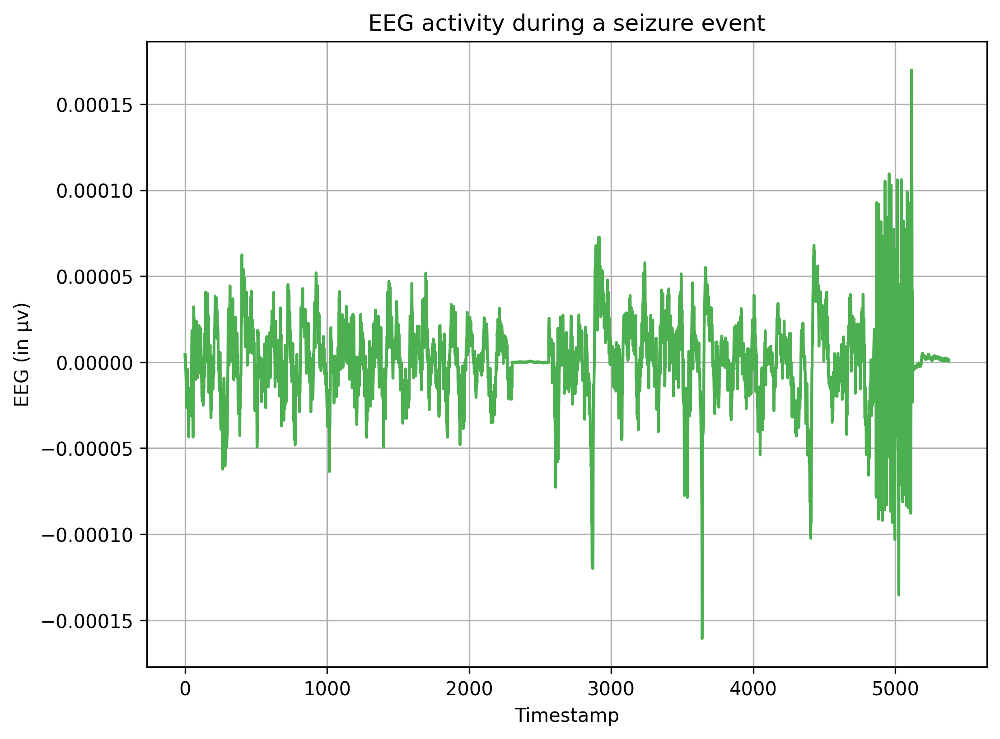
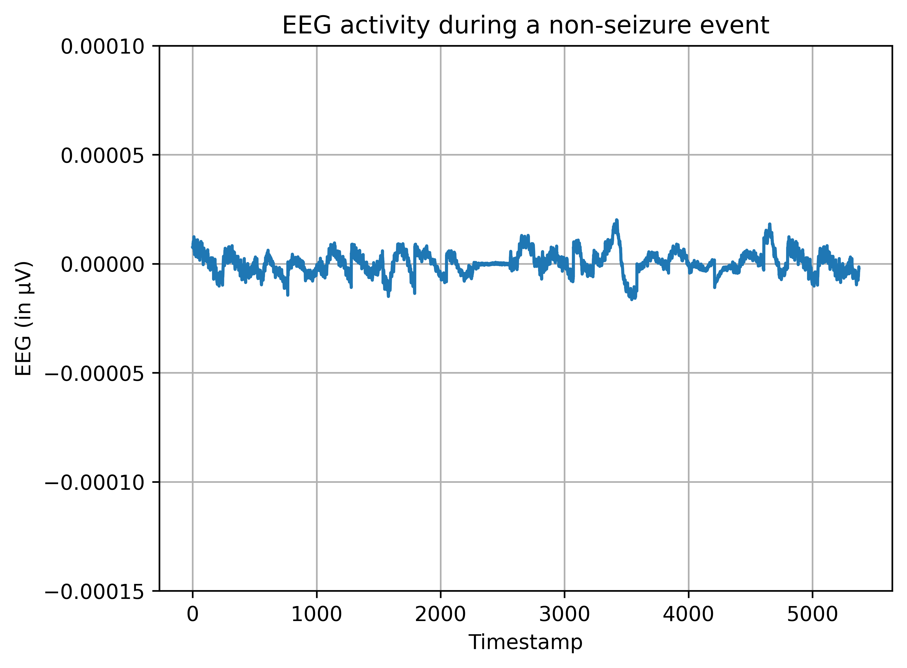
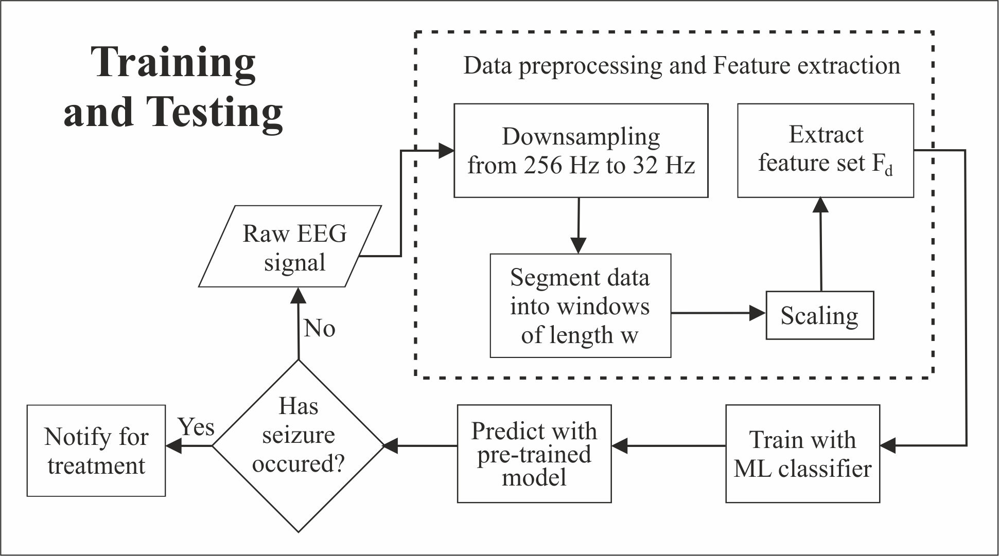

# NeonatalSeizureDetection

## Description

Link: https://ieeexplore.ieee.org/document/9760524

Citation:

```
@INPROCEEDINGS{9760524,
    author={Nagarajan, Vishal and Muralidharan, Ashwini and Sriraman, Deekshitha and Pravin Kumar, S},  
    booktitle={2022 2nd International Conference on Artificial Intelligence and Signal Processing (AISP)},   
    title={Scalable Machine Learning Architecture for Neonatal Seizure Detection on Ultra-Edge Devices},   
    year={2022},  
    volume={},  
    number={},  
    pages={1-6},  
    doi={10.1109/AISP53593.2022.9760524}}
```

This repository contains code for the implementation of the paper titled **Scalable Machine Learning Architecture for Neonatal Seizure Detection on Ultra-Edge Devices**, which has been **published** at the [AISP '22: 2<sup>nd</sup> International Conference on Artificial Intelligence and Signal Processing](https://www.aisp.in/). A typical neonatal seizure and non-seizure event is illustrated below. Continuous EEG signals are filtered and segmented with varying window lengths of 1, 2, 4, 8, and 16 seconds. The data used here for experimentation can be downloaded from [here](https://zenodo.org/record/1280684).

<p>
    
    
</p>

This end-to-end architecture receives raw EEG signal, processes it and classifies it as ictal or normal activity. After preprocessing, the signal is passed to a feature extraction engine that extracts the necessary feature set Fd. It is followed by a scalable machine learning (ML) classifier that performs prediction as illustrated in the figure below.

<p>
    
</p>

## Files description

1. [dataprocessing.ipynb](https://github.com/vishaln15/NeonatalSeizureDetection/blob/main/datapreprocessing.ipynb) -> Notebook for converting edf files to csv files.
2. [filtering.ipynb](https://github.com/vishaln15/NeonatalSeizureDetection/blob/main/filtering.ipynb)      -> Notebook for filtering the input EEG signals in order to observe the specific frequencies.
3. [segmentation.ipynb](https://github.com/vishaln15/NeonatalSeizureDetection/blob/main/segmentation.ipynb)   -> Notebook for segmenting the input into appropriate windows lengths and overlaps.
4. [features_final.ipynb](https://github.com/vishaln15/NeonatalSeizureDetection/blob/main/features_final.ipynb) -> Notebook for extracting relevant features from segmented data.
5. [protoNN_example.py](https://github.com/vishaln15/NeonatalSeizureDetection/blob/main/protoNN_example.py)   -> Script used for running protoNN model using *.npy* files.
6. [inference_time.py](https://github.com/vishaln15/NeonatalSeizureDetection/blob/main/inference_time.py)    -> Script used to record and report inference times.
7. [knn.ipynb](https://github.com/vishaln15/NeonatalSeizureDetection/blob/main/knn.ipynb)            -> Notebook used to compare results of ProtoNN and kNN models.

## Dependencies

If you are using conda, it is recommended to switch to a new environment.

```
    $ conda create -n myenv
    $ conda activate myenv
    $ conda install pip
    $ pip install -r requirements.txt
```

If you wish to use virtual environment,

```
    $ pip install virtualenv
    $ virtualenv myenv
    $ source myenv/bin/activate
    $ pip install -r requirements.txt
```

## Usage

1. Clone the **ProtoNN** package from [here](https://github.com/microsoft/edgeml/), **antropy** package from [here](https://github.com/raphaelvallat/antropy/), and **envelope_derivative_operator** package from [here](https://github.com/otoolej/envelope_derivative_operator/).

2. Replace the [protoNN_example.py](https://github.com/microsoft/EdgeML/blob/master/examples/pytorch/ProtoNN/protoNN_example.py) with [protoNN_example.py](https://github.com/vishaln15/NeonatalSeizureDetection/blob/main/protoNN_example.py).

3. Prepare the train and test data *.npy* files and save it in a *DATA_DIR* directory.

4. Execute the following command in terminal after preparing the data files. Create an output directory should you need to save the weights of the ProtoNN object as *OUT_DIR*.
    ```
        $ python protoNN_example.py -d DATA_DIR -e 500 -o OUT_DIR
    ```

## Authors

[**Vishal Nagarajan**](https://www.linkedin.com/in/vishalnagarajan/)

[**Ashwini Muralidharan**](https://github.com/Ashwiinii)

[**Deekshitha Sriraman**](https://github.com/dtg311)


## Acknowledgements

ProtoNN built using [EdgeML](https://github.com/microsoft/edgeml/) provided by [Microsoft](https://github.com/microsoft/). Features extracted using [antropy](https://github.com/raphaelvallat/antropy/) and [otoolej](https://github.com/otoolej/envelope_derivative_operator/) repositories. 

## References

[1] Nathan Stevenson, Karoliina Tapani, Leena Lauronen, & Sampsa Vanhatalo. (2018). A dataset of neonatal EEG recordings with seizures annotations [Data set]. Zenodo. https://doi.org/10.5281/zenodo.1280684. 

[2] Gupta, Ankit et al. "ProtoNN: Compressed and Accurate kNN for Resource-scarce Devices." Proceedings of the 34th International Conference on Machine Learning, Sydney, Australia, PMLR 70.